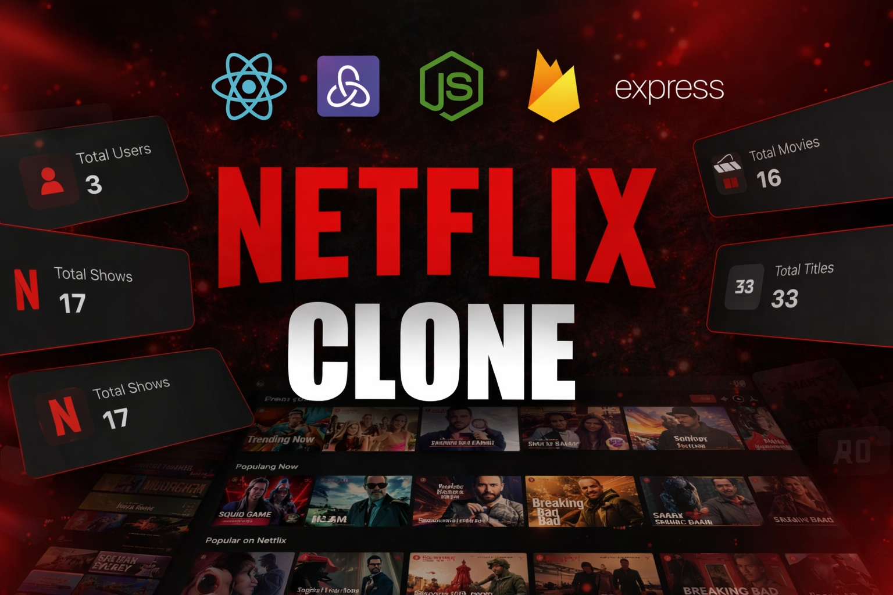

 

  

    
    
    
    
  

  <h3 align="center">Netflix Clone (MERN Stack Full-Stack App)</h3>

This is a full-stack MERN (MongoDB, Express.js, React.js, Node.js) application that replicates the core functionalities of Netflix. It features **user authentication**, **movie browsing**, **video streaming UI**, **search feature** and a **search history system**. This project demonstrates a seamless integration of frontend and backend technologies to build a robust streaming service-like experience, with full responsiveness and secure user flows.

## Features & Highlights : 

1) **Movies & Series Sections 🎬📺:** The homepage is divided into two separate sections—one for Movies and another for Series, making it easy to browse by category.
   
2) **Search Functionality 🔎:** A powerful search bar allows users to search for movies, series, or actors by name.
   
3) **Search History 🕵️:** The app tracks and stores a search history, so users can easily revisit previously watched or searched content.
 
4) **Detailed Movie Page 📝🎞:** Clicking on a title shows in-depth info, the trailer, and a carousel of similar recommendations based on that content.

5) **User Authentication 🔐:** Secure registration and login system with JWT-based authentication.

6) **Responsive Design 📱💻:** This website is highly responsive and works well on all screen sizes. 

7) **Streaming UI 🍿:** Designed to replicate the Netflix user experience with hover effects, trailer previews, and category sliders.

8) **MongoDB Integration 🍃:** All user data and preferences are stored persistently using MongoDB Atlas and Mongoose.

9) **Protected Routes 🛡:** Authenticated routes ensure that only logged-in users can access personal content like the dashboard or watchlist.

---

## Pages

### 1. **Home Page** 🏠  
   - Top rated and popular shows and movies.
   - Responsive grid layout with movie posters.

### 2. **Auth Pages** 🔑  
   - Login and Signup pages with validation.
   - JWT is stored in localStorage and used for protected routes.

### 3. **Movie Details Page** 📽  
   - Click a title to view detailed info, trailer, a description and similar movies.

### 4. **Search History Page** 📋  
   - View recently seached shows in this and you can easily remove the search history according to you.

### 5. **Search Result Page** :
- This page will display the result for what the user has asked for.

---
## Screenshots & Demo 📸

### 💻 Desktop View

 

   
  
### 📱 Mobile View

[  ]

---
## Technologies Used 🛠️

- **MongoDB**: NoSQL database for storing user email and password.
- **Express.js**: Backend framework for handling API routes and middleware.
- **React.js**: Frontend library for building dynamic UIs.
- **Node.js**: JavaScript runtime for building the backend server.
- **JWT (jsonwebtoken)**: Used for user authentication.
- **Axios**: For making HTTP requests from the frontend.
- **TailwindCSS**: For making the website responsive.
- **React Router**: For client-side routing and navigation.
- **Context API / Redux**: For state management.
- **Lucide React** : For icons used in the clone.
- **React Hot Toast** : For popups in case of email, password or other errors.
- **Bcrypt JS** : For hashing the password.

---

## Installation 🛠️ :
You need to install some dependencies using the command terminal so that the code runs smoothly on your device.

1) React :
`npm install `

2) Tailwind CSS :
   `npm install -D tailwindcss@3 postcss autoprefixer`
     
    `npx tailwindcss init  -p`

3) Mongoose : For operating mongo db
   `npm install mongoose`

4) Express :
   `npm install express`

5) JWT :
   `npm install jsonwebtoken`
6) Axios :
   `npm install jsonwebtoken`
7) React Router :
`npm install react-router-dom`
8) Lucide React
 `npm install lucide-react`
9) React Hot Toast :
`npm install react-hot-toast`
10) Bcrypt JS : 
`npm install bcryptjs`
---

## Contributing 🤝

All contributions are welcome! If you'd like to add features or fix bugs:

1. Fork the repo
2. Create a new branch 
3. Make your changes
4. Commit your changes
5. Push to your fork 
6. Submit a pull request

---

## License 📄

MIT License

Copyright (c) 2026 K Tirumala Achari

Permission is hereby granted, free of charge, to any person obtaining a copy
of this software and associated documentation files (the "Software"), to deal
in the Software without restriction, including without limitation the rights
to use, copy, modify, merge, publish, distribute, sublicense, and/or sell
copies of the Software, and to permit persons to whom the Software is
furnished to do so, subject to the following conditions:

The above copyright notice and this permission notice shall be included in all
copies or substantial portions of the Software.

  
## 👨‍💻 Author
**K Tirumala Achari**  
Full Stack Developer

_Computer Science And Engineering Student_  
_NIST University, Berhampur Odisha India_

